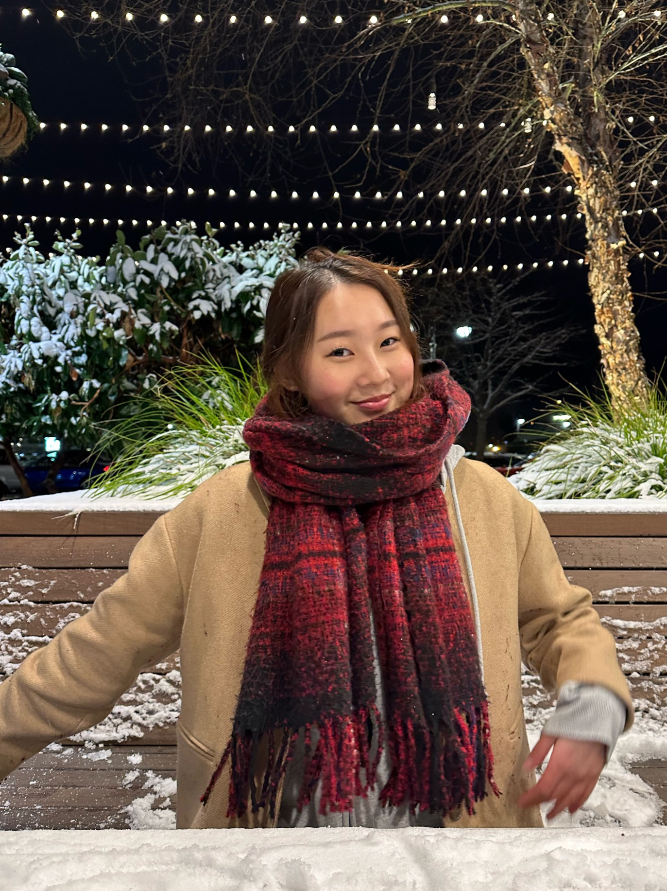
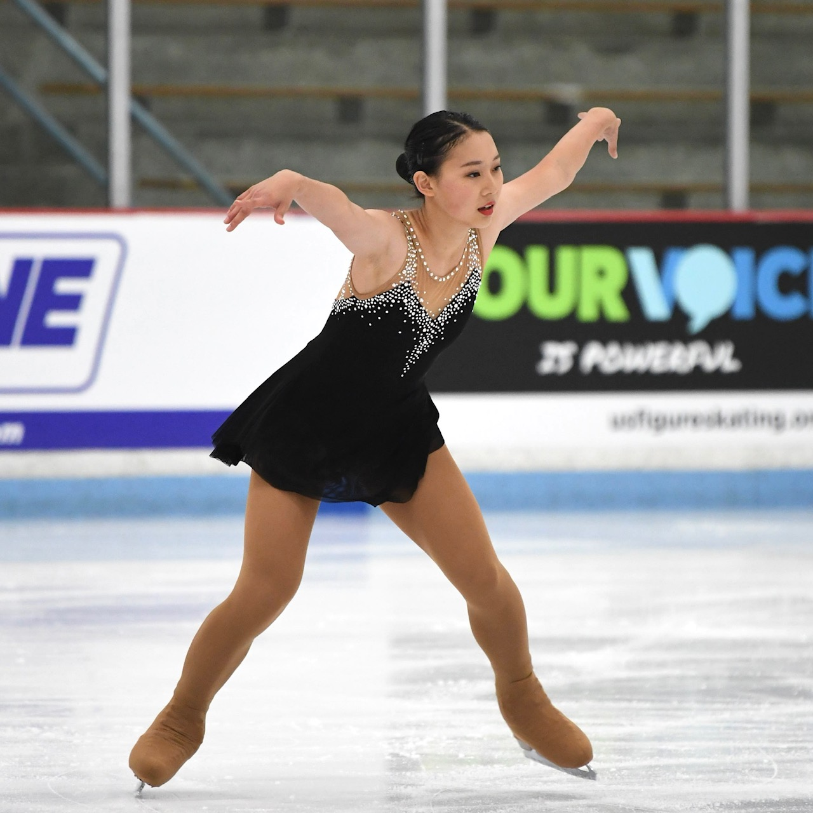

# **HOLLY ZHU**

Hello all! My name is Holly, and here's a little to get to know me. Feel free to scroll around!

## **ME, PROFESSIONALLY:**
I came into UCSD as a Computer Science major with a specialization in Bioinformatics. Honestly, I ended up choosing it because I was stuck between pre-med and CS, and that major seemed to have both. But I soon realized that the natural sciences weren't really my thing- I struggled a *lot* with chemistry courses.

To explore my major further, I joined a research lab as a bioinformatics research assistant (If you are interested, [click here](https://www.bryansunlab.com/) to see more about what our lab does). My position was very much self-driven, so I had the opportunity to learn **R programming** on my own to make visualizations of RNA-seq data. I appreciated the lessons I learned, but soon realized that bioinformatics wasn't the path for me. So just this quarter, I dropped my bioinformatics specialization and picked up a minor in one of my original passions:

> **_DESIGN._**

Recently, I have been learning more about the design side of programming. I'm looking into **UI/UX** or **frontend development**, and I thoroughly enjoyed my first design class. Over spring break, I started to self-learn **HTML and CSS** to build a personal website.

[CLICK HERE](https://hollyzhu573.github.io/index.html) to see my personal website (very much a work in progress oops)

I first got into programming because of my dad, who works as a software engineer at Microsoft. I started learning languages, starting with **Java** in AP Computer Science, then adding **Python, C#, and C** through college. I've dabbled a little in working with **Swift and Rect Native**, but I wouldn't say I know enough to confidently say I know them.

> *I'm looking forward to growing my skills and experiencing the various sides of computer science throughout the rest of my time here at UCSD!*

## **ME, PERSONALLY:**

I grew up in Seattle, WA for most of my life. Most people hate it because of the rain, but I actually miss it quite a bit. Besides school and CS, some of my hobbies include:

- **FIGURE SKATING:** I've been skating since I was 6 and it's been a part of my life for as long as I can remember. I used to compete before COVID ruined those plans, but I am slowly getting back into it here at school now!

- **CALLIGRAPHY/DRAWING:** I have always loved lettering and calligraphy as a hobby, and I'm also trying to learn basic animation of Procreate!
- **MUSIC:** I played the violin from elementary school and switched to the viola in seventh grade, playing in our school orchestra. I also love listening to music- my favorite genres are kpop, indie, and k-rnb.
  
**_Thanks for taking the time to get to know me a bit!_**